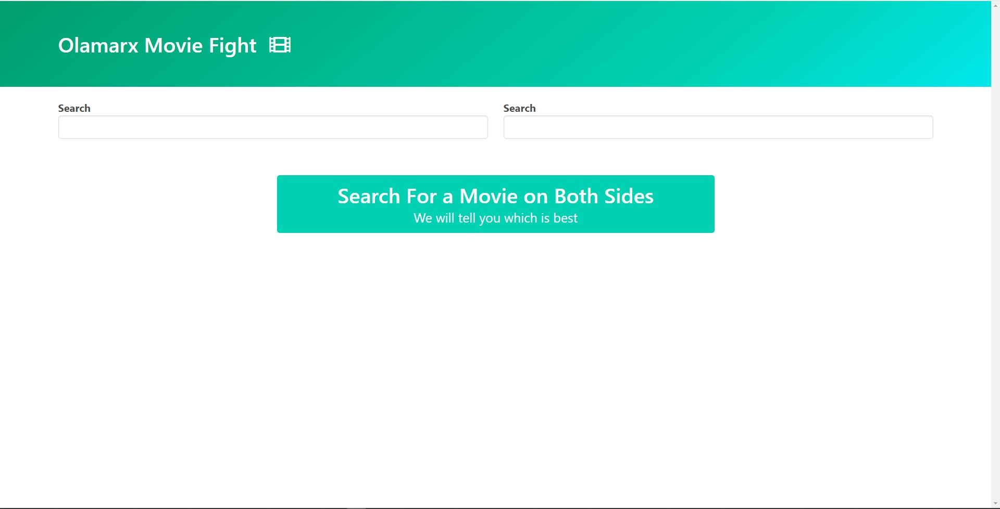

## Application View

  

# Udemy's Javascript Second Project
> This my first project working with API and definitely, I am learning more and building more.
> This Project is about comparing two movies together and it will draw the differences and give you the better one in terms of awards, sales and ranking.

## Built by Olaoluwa Owoeye (Olamarx)

- HTML
- CSS
- JavaScript
 - API
  -Axios Library
## Live Demo

[Live Demo Link](https://olamarx.github.io/Movie-API/)

## Set-up linters in your local machine

## Getting Started

#### run "git clone https://github.com/Olamarx/Movie-API.git"

#### Kindly don't run the quotation mark with it.

## Author

👤 **Owoeye Olaoluwa (Olamarx)**

- GitHub: [@githubhandle](https://github.com/Olamarx)
- Twitter: [@twitterhandle](https://twitter.com/Owoeye0laoluwa)
- LinkedIn: [LinkedIn](https://www.linkedin.com/in/olaoluwa-owoeye-617702162/)
- Facebook: [Facebook](https://web.facebook.com/olaoluwa.owoeye.39)

## 🤝 Contributing

Contributions, issues, and feature requests are welcome!

Feel free to check the [issues page](https://github.com/Olamarx/Movie-API/issues).

## Show your support

Give a ⭐️ if you like this project!

## Acknowledgments

- Original design idea by Stephen Grider on Udemy, he happens to be the project teacher too.

## 📝 License

This project is [MIT](./MIT.md) licensed.
